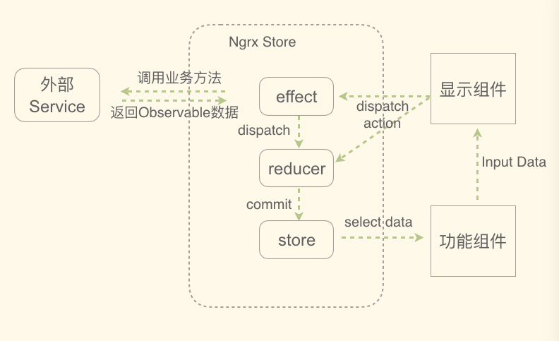

# NgrxStoreDemo01

This project was generated with [Angular CLI](https://github.com/angular/angular-cli) version 1.7.4.

## Development server

Run `ng serve` for a dev server. Navigate to `http://localhost:4200/`. The app will automatically reload if you change any of the source files.

## Code scaffolding

Run `ng generate component component-name` to generate a new component. You can also use `ng generate directive|pipe|service|class|guard|interface|enum|module`.

## ngrx/store relational graph

## desc
* `npm install` install packages;
* `npm start` start the project in localhost:4200 server 

